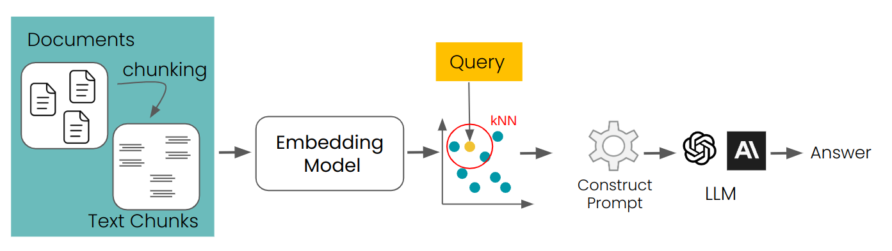
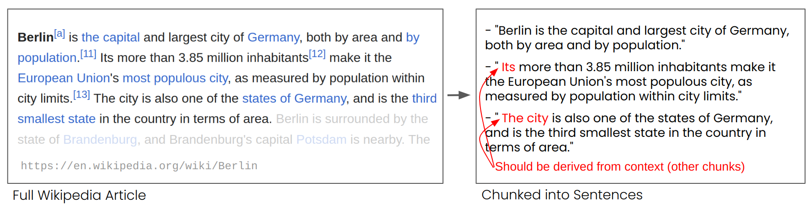
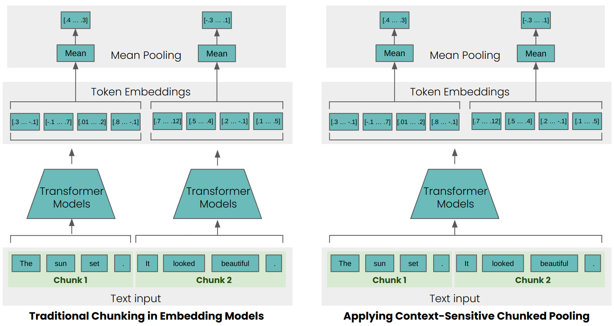

# Late Chunking of Short Chunks in Long-Context Embedding Models

[**Blog post**](https://jina.ai/news/late-chunking-in-long-context-embedding-models) | [**ArXiv paper**](https://arxiv.org/abs/2409.04701)

For many applications, encoding a whole text document into a single embedding representation is not useful. Many applications require retrieving smaller parts of the text and dense vector-based information retrieval systems often perform better with smaller text segments because of the limited information capacity of embedding vectors.




RAG (Retrieval Augmented Generations) is one of the best known applications to require splitting document collections into smaller text chunks. These chunks are typically stored in a vector database with vector representations created by a text embedding model.
At runtime, the same embedding model encodes a query text into a vector representation, which is used to identify relevant stored text chunks. These are them passed to a large language model (LLM) which synthesizes a response to the query based on the retrieved texts.

## Context Problem


This simple RAG approach is not without challenges. Long distance contextual dependencies, i.e. when the relevant information is spread over multiple chunks and taking text segments out of context makes them useless, are particularly poorly handled by this approach.

In the image above one can see an Wikipedia article that is split into chunks of sentences.
One can see that phrases like "its" and "the city" referencing "Berlin" which is mentioned only in the first sentence, e.g., it is harder for the embedding model to link it to the respective entity to produce a high-quality embedding representation.


For example, if we split a Wikipedia article into sentence-length segments, as in the example above, a RAG system might not be able to answer a query like "What is the population of Berlin?" The city name and the population never appear together in a single segment, and lacking any larger document context.
An LLM to which one of the segments is presented cannot resolve the anaphoric references like "it" or "the city".

## Context-Sensitive Chunking

To overcome this problem, we take advantage of the long input sequences that recent embedding models like [`jina-embeddings-v2-base-en`](https://huggingface.co/jinaai/jina-embeddings-v2-base-en) can process.
These models support much longer input texts, for example, 8192 tokens for `jina-embeddings-v2-base-en` or roughly ten standard pages of text. Text segments of this size are much less likely to have contextual dependencies that can only be resolved with a larger context.
However, we still need vector representations of much smaller chunks of text, in part because of the limited input sizes of LLMs but primarily because of the limited information capacity of short embedding vectors.




The simple encoding approach (as seen on the left side of the image above) chunks texts before processing them, using sentences, paragraphs, and maximum length limits to split text _a priori_, and then applying an embedding model to the resulting chunks.
Late Chunking, instead, first applies the transformer part from the embedding model to the entire text, or the largest part of it possible. This generates a sequence of vector representations for each token that encompass textual information from the entire text.
To generate a single embedding for a text, many embedding models apply _mean pooling_ to these token representations to output a single vector. Late Chunking instead applies mean pooling to smaller segments of this sequence of token vectors, producing embeddings for each chunk that take into account the entire text. 

## The Effect of Context-Sensitive Chunking

This has immediately measurable concrete effects on retrieval. As an example, in case of "the city" and "Berlin" in a Wikipedia article, the vectors representing "the city" contain information connecting it to the previous mention of "Berlin", making it a much better match for queries involving that city name.

You can see that in numerical results below, which compares the embedding of the string "Berlin" to various sentences from the article about Berlin. The column "Traditional Similarity" is the similarity values using _a priori_ chunking, and "Late Chunking Similarity" is with context-sensitive chunking.

| Text                                                                                                                                  | Similarity Traditional | Similarity Late Chunking  |
|---------------------------------------------------------------------------------------------------------------------------------------|------------------------|-------------------------------|
| Berlin is the capital and largest city of Germany, both by area and by population."                                                   | 0.84862185             | 0.849546                      | 
| Its more than 3.85 million inhabitants make it the European Union's most populous city, as measured by population within city limits. | 0.7084338              | 0.82489026                      |
| The city is also one of the states of Germany, and is the third smallest state in the country in terms of area.                       | 0.7534553              | 0.84980094                    |

As you can see the similarity scores for the first chunk that contains "Berlin" are very close to each other.
For the other two chunks they siginificantly differ, as the late chunking dramatically improves matching on sentences that do not explicitly use the word "Berlin" but have anaphoric references to it.

## Evaluation on Retrieval Tasks


To verify the effectiveness of this approach beyond a few toy examples, we tested it with some of the retrieval benchmarks from [BeIR](https://github.com/beir-cellar/beir).
Those retrieval tasks consist of a query set, a corpus of text documents, and a QRels file that stores information about the IDs of documents that are relevant for each query.
To identify the relevant documents of a query, one can chunk the documents, encode them into an embedding index, and determine for each query embedding the most similar chunks (kNN).
As each chunk corresponds to a document, one can convert the kNN ranking of chunks into a kNN ranking of documents (for documents occurring multiple times in the ranking, only the first occurrence is retained).
After that, one can compare the resulting ranking with the ranking corresponding to the ground-truth QRels file and calculate retrieval metrics like nDCG@10.
We run this evaluation for various BeIR datasets with traditional chunking and our novel late chunking method.
To split texts into chunks, we choose a straightforward method, which chunks the tests into strings of 256 tokens.
Both the traditional and late chunking tests used the [jina-embeddings-v2-small-en](https://huggingface.co/jinaai/jina-embeddings-v2-small-en) model.

| Dataset   | AVG Document Length (characters) | Traditional Chunking (nDCG@10) | Late Chunking (nDCG@10) | No Chunking (nDCG@10) |
|-----------|----------------------------------|--------------------------------|--------------------------------------|-----------------------|
| SciFact   |                           1498.4 |                         64.20% |                           **66.10%** |                63.89% |
| TRECCOVID |                           1116.7 |                         63.36% |                               64.70% |            **65.18%** |
| FiQA2018  |                            767.2 |                         33.25% |                           **33.84%** |                33.43% |
| NFCorpus  |                           1589.8 |                         23.46% |                               29.98% |            **30.40%** |
| Quora     |                             62.2 |                         87.19% |                               87.19% |                87.19% |

In all cases, late chunking improved the score. In some cases, it also outperforms encoding the whole document into a single embedding, while for other datasets, no chunking performs best. However, this only makes sense if one does not need to rank chunks. One can also see that the average length of the documents correlates with greater improvement in the nDCG scores through late chunking.

To reporoduce the evaluation, you can install the dependencies with `pip install .` and run the following script for the tasks "SciFactChunked", "TRECCOVIDChunked", "FiQA2018Chunked", "NFCorpusChunked", and "QuoraChunked":

```bash
python3 run_chunked_eval.py --task-name {TASK_NAME}
```

## Acknowledgement and References

Thanks to Isabelle Mohr([@violenil](https://github.com/violenil)) for contributing some code and Scott Martens ([@scott-martens](https://github.com/scott-martens)) for reviewing the README.

More about the Evaluation tasks can be found in the [MTEB Repository](https://github.com/embeddings-benchmark/mteb) and details about the training of the models for long input text in our paper: ["Jina embeddings 2: 8192-token general-purpose text embeddings for long documents."](https://arxiv.org/abs/2310.19923)

If you find Late Chunking useful in your research, use can cite the paper [Late Chunking: Contextual Chunk Embeddings Using Long-Context Embedding Models](https://arxiv.org/abs/2409.04701):

```
@article{gunther2024late,
  title={Late Chunking: Contextual Chunk Embeddings Using Long-Context Embedding Models},
  author={G{\"u}nther, Michael and Mohr, Isabelle and Wang, Bo and Xiao, Han},
  journal={arXiv preprint arXiv:2409.04701},
  year={2024}
}
```
